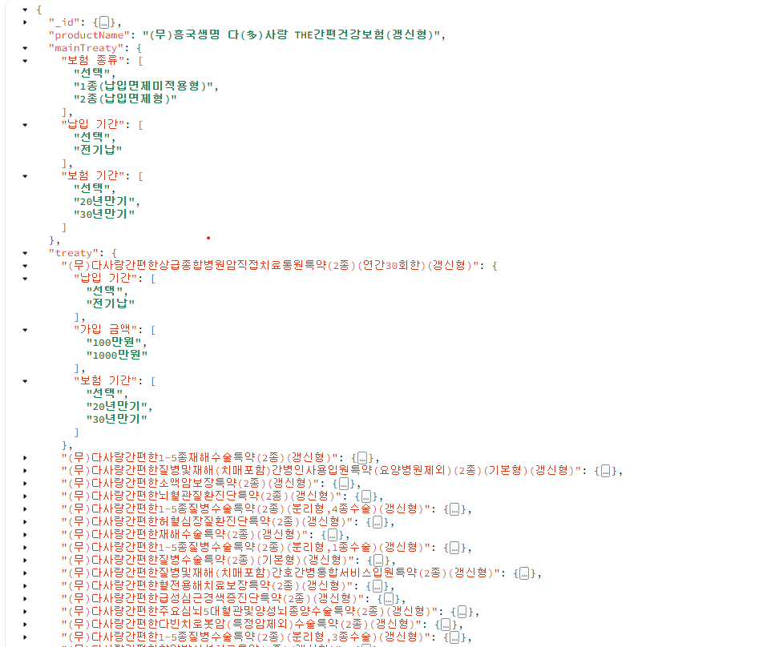

## MONGO DB 지식 공유 및 TEST
### 데이터 수집 시 기존의 RDB 가 아닌 NoSQL 중 하나인 MongoDB 의 활용 가능성과 지식을 공유하기 위해 작성된 CODE 입니다.

### 작업 내용
> 1. MongoDB 에 적재할 Document 객체 생성
> 2. MongoRepository 생성
> 3. CRUD 기능을 위한 MongoService 작성
> 4. 웹 페이지 ScrapService 작성
> 5. Controller 에 하나의 진입점을 두고 Service 를 분기하기 위한 ServiceFinder 작성

### 작업 결과물
> #### - 적재 된 실제 Data -
> 

> #### - MongoDB 조사 결과 -
> [MongoDB Test Report.pdf](..%2F..%2FUsers%2Fwelgram-heejun%2FDownloads%2FMongoDB%20Test%20Report.pdf)